# Space Images

## `eso1242a`  

### Central Milky Way Mosaic

[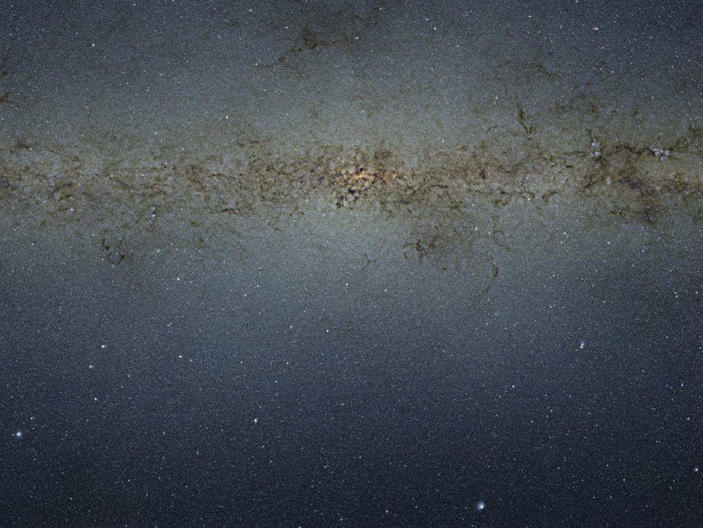](./eso1242a)

[Source](https://www.eso.org/public/images/eso1242a/)  
ESO/VVV Survey/D. Minniti

## `heic0707a`

### Star Birth in the Extreme

[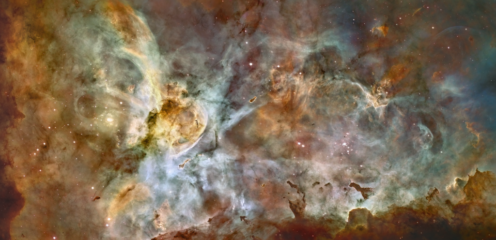](./heic0707a)

[Source](https://www.spacetelescope.org/images/heic0707a/)  
NASA/ESA/N. Smith (U.C. Berkeley)/Hubble Heritage Team (STScI/AURA)

## `heic1501a`

### Pillars of Creation

[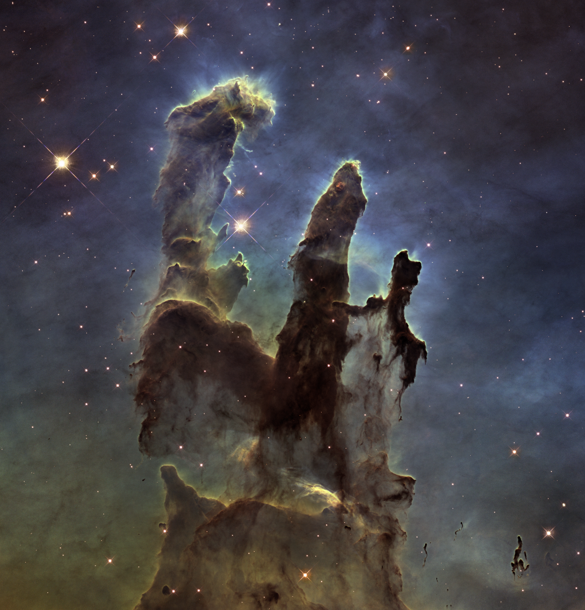](./heic1501a)

[Source](https://www.spacetelescope.org/images/heic1501a/)  
NASA/ESA/Hubble/Hubble Heritage Team

## `heic1509a`

### Westerlund 2

[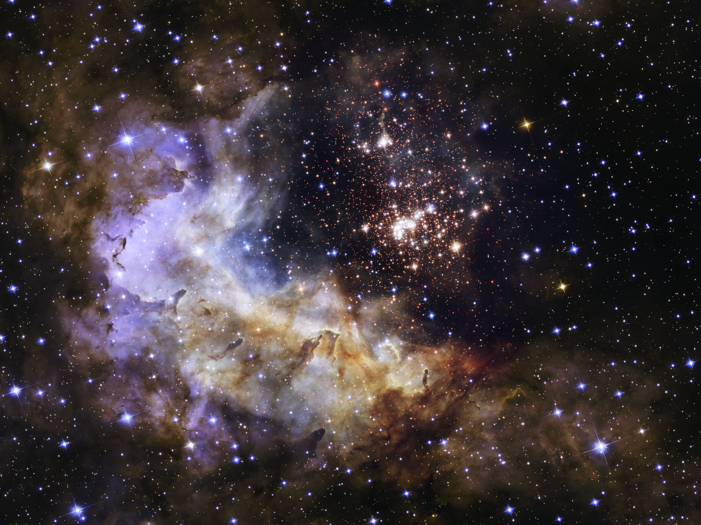](./heic1509a)

[Source](https://www.spacetelescope.org/images/heic1509a/)  
NASA/ESA/Hubble Heritage Team (STScI/AURA)/A. Nota (ESA/STScI)/Westerlund 2 Science Team

## `heic1608a`

### The Bubble Nebula

[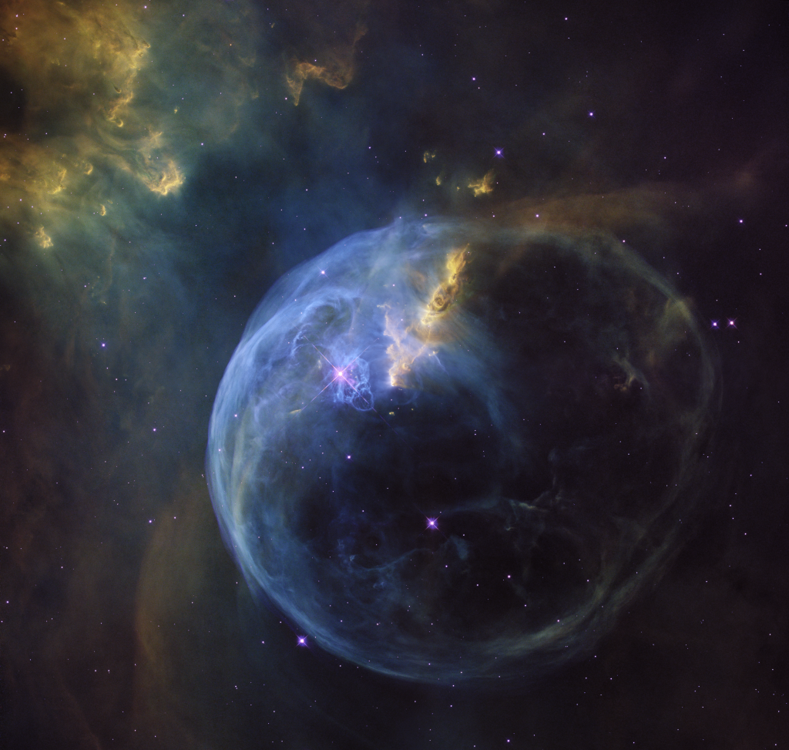](./heic1608a)

[Source](https://www.spacetelescope.org/images/heic1608a/)  
NASA/ESA/Hubble Heritage Team

## `heic1808a`

### Lagoon Nebula

[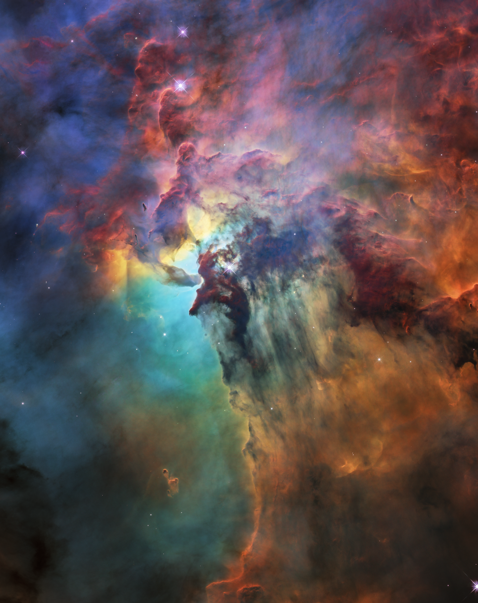](./heic1808a)

[Source](https://www.spacetelescope.org/images/heic1808a/)  
NASA/ESA/STScI

## `heic2002a`

### UCG 2885

[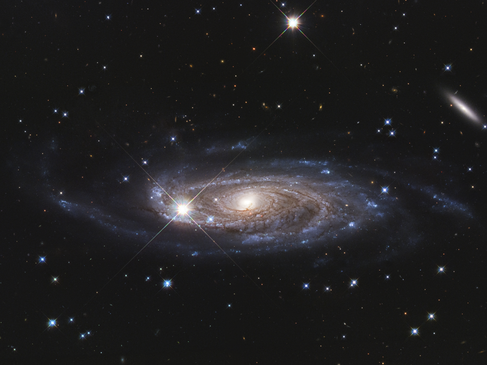](./heic2002a)

[Source](https://www.spacetelescope.org/images/heic2002a/)  
NASA/ESA/B. Holwerda (University of Louisville)

## `heic2002b`

### Area Around UCG 2885

[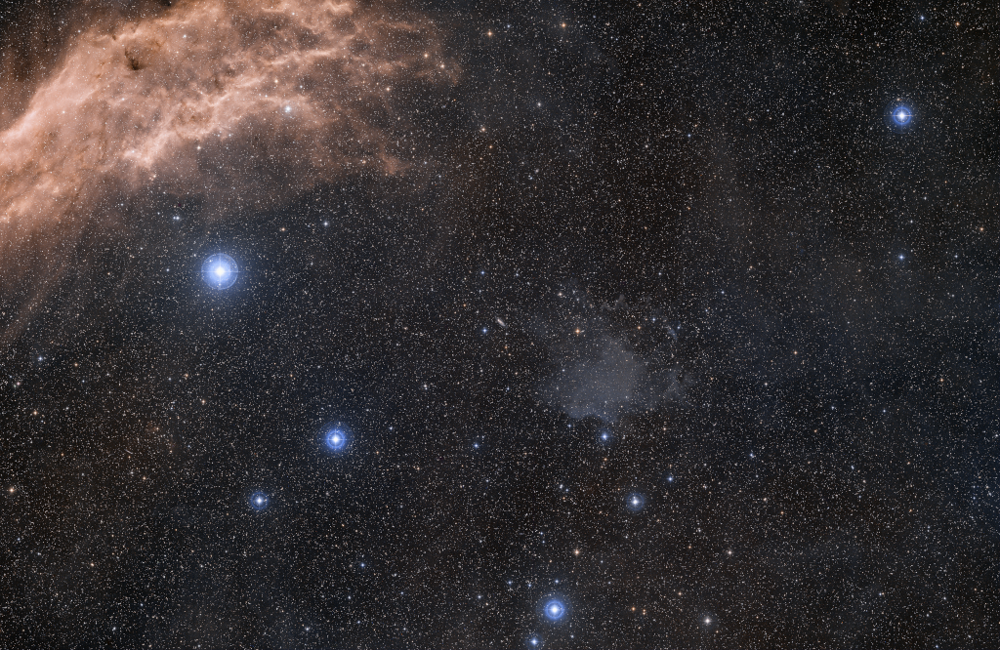](./heic2002b)

[Source](https://www.spacetelescope.org/images/heic2002b/)  
ESA/Digitized Sky Survey 2/Davide De Martin

## `opo0928b`

### Galactic Center Region

[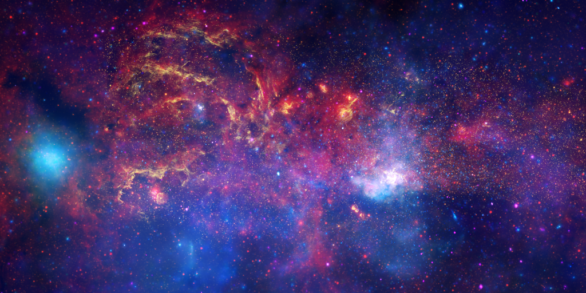](./opo0928b)

[Source](https://www.spacetelescope.org/images/opo0928b/)  
NASA/ESA/SSC/CXC/STScI

## `potw1411a`

### Secrets at the Heart of NGC 5793

[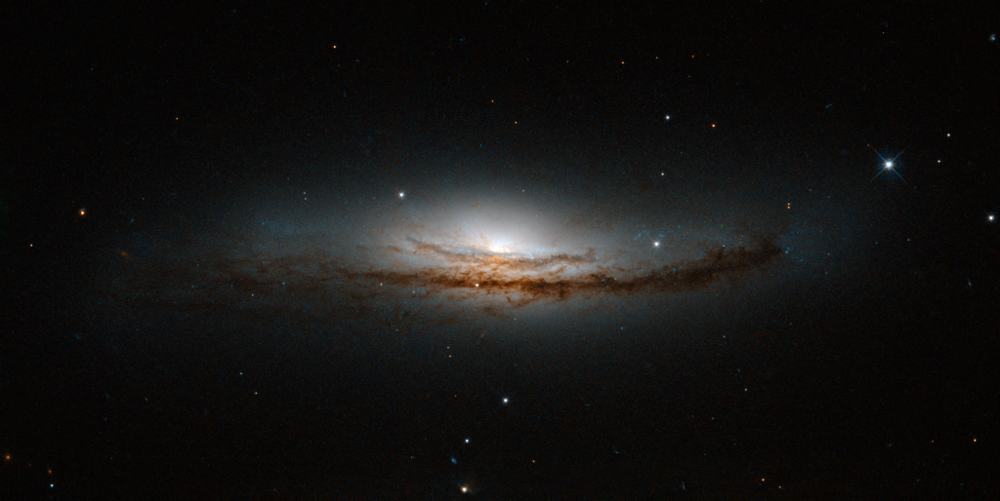](./potw1411a)

[Source](https://www.spacetelescope.org/images/potw1411a/)  
NASA/ESA/E. Perlman (Florida Institute of Technology)/Judy Schmidt

## `potw1805a`

### Twins with Differences

[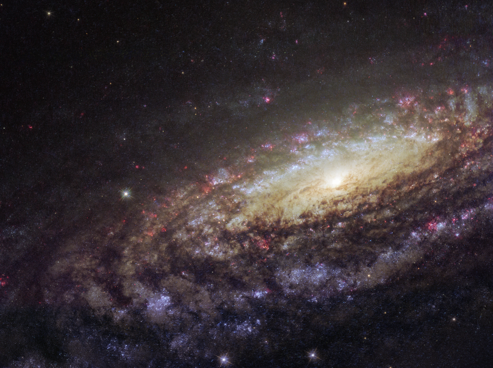](./potw1805a)

[Source](https://www.spacetelescope.org/images/potw1805a/)  
ESA/Hubble/NASA/D. Milisavljevic (Purdue University)

## `potw2004a`

### Bars and Baby Stars

[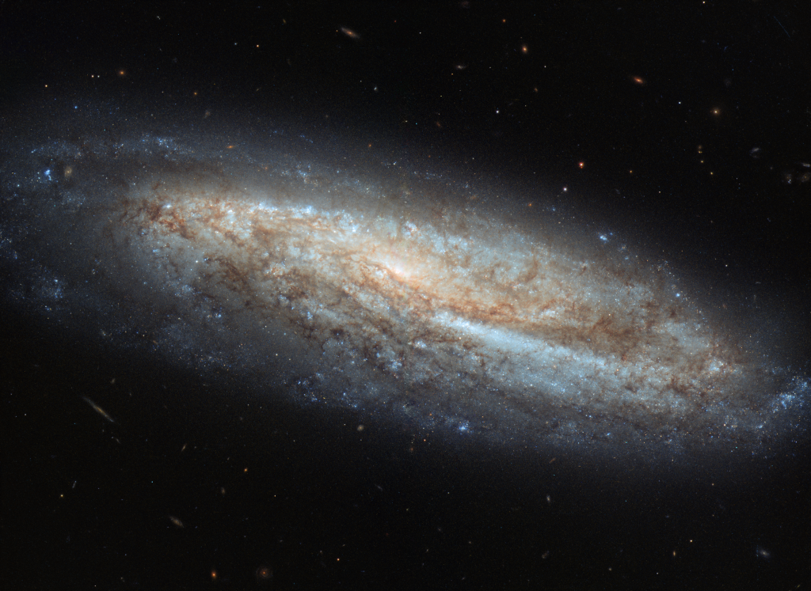](./potw2004a)

[Source](https://www.spacetelescope.org/images/potw2004a/)  
ESA/Hubble/NASA/A. Riess et al.