# Space Wallpapers

This is a project I've undertaken as a hobby to gain a better understanding of astronomy.

> Thumbnails in this document show the original aspect ratio.

## `eso0907a`

### The Helix Nebula

[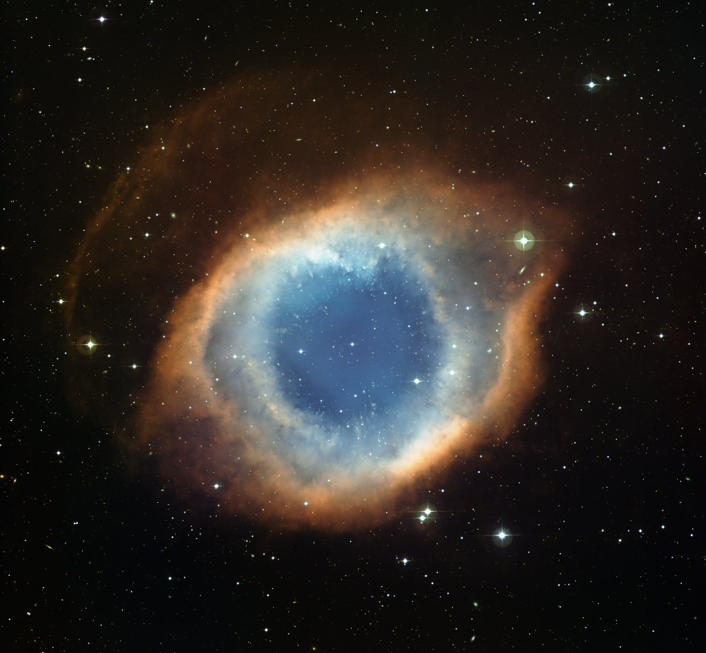](./eso-eso0907a)  

[Source](https://www.eso.org/public/images/eso0907a/)  
ESO  

## `eso0932a`

### The Milky Way Panorama

  

[Source](https://www.eso.org/public/images/eso0932a/)  
ESO/S. Brunier  

## `eso1119b`

### VST Image of the Giant Blobular Cluster Omega Centauri

[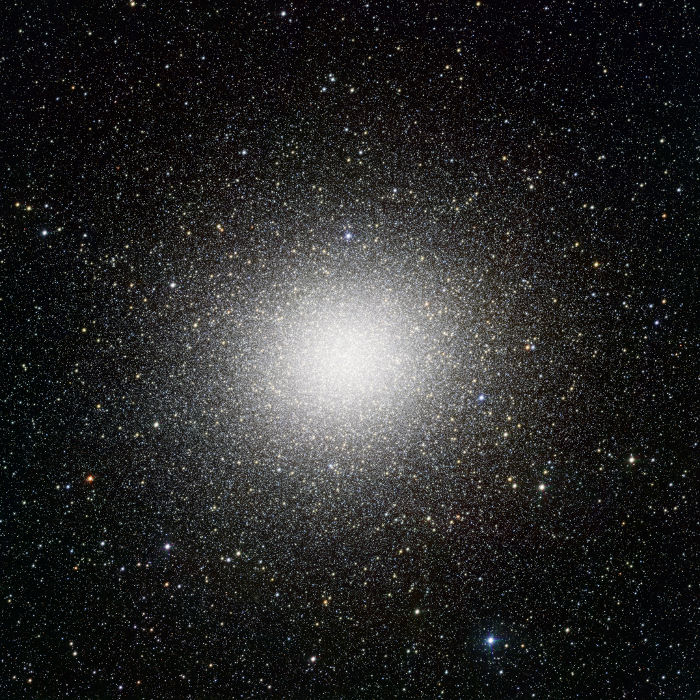](./eso-eso1119b)  

[Source](https://www.eso.org/public/images/eso1119b/)  
ESO/INAF-VST/OmegaCAM/A. Grado/L. Limatola/INAF-Capodimonte Observatory  

## `eso1208a`

### ESO's VLT Reveals the Carina Nebula's Hidden Secrets

  

[Source](https://www.eso.org/public/images/eso1208a/)  
ESO/T. Preibisch  

## `eso1242a`

### Central Milky Way Mosaic

[Source](https://www.eso.org/public/images/eso1242a/)  
ESO/VVV Survey/D. Minniti  

## `eso1907a`

### First Image of a Black Hole

  

[Source](https://www.eso.org/public/images/eso1907a/)  
EHT Collaboration  

## `potw1226a`

### Mars, 2099?

  

[Source](https://www.eso.org/public/images/potw1226a/)  
ESO/J.Girard (djulik.com)    

## `vlt-mw-potw`

### Rare 360-degree Panorama of the Southern Sky

  

[Source](https://www.eso.org/public/images/vlt-mw-potw/)  
ESO/H.H. Heyer  

## `heic0506a`

### Out of this Whirl: The Whirlpool Galaxy (M51) and Companion Galaxy

[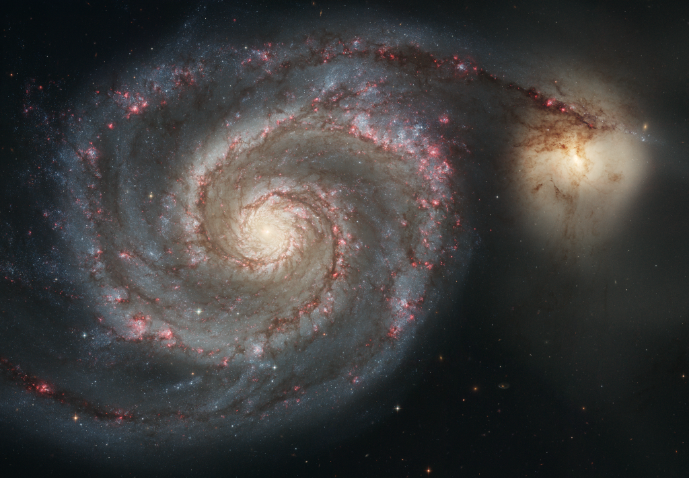](./hst-heic0506a)  

[Source](https://www.spacetelescope.org/images/heic0506a/)  
NASA/ESA/S. Beckwith (STScI)/The Hubble Heritage Team (STScI/AURA)  

## `heic0506b`

### The Eagle has Risen: Stellar Spire in the Eagle Nebula

[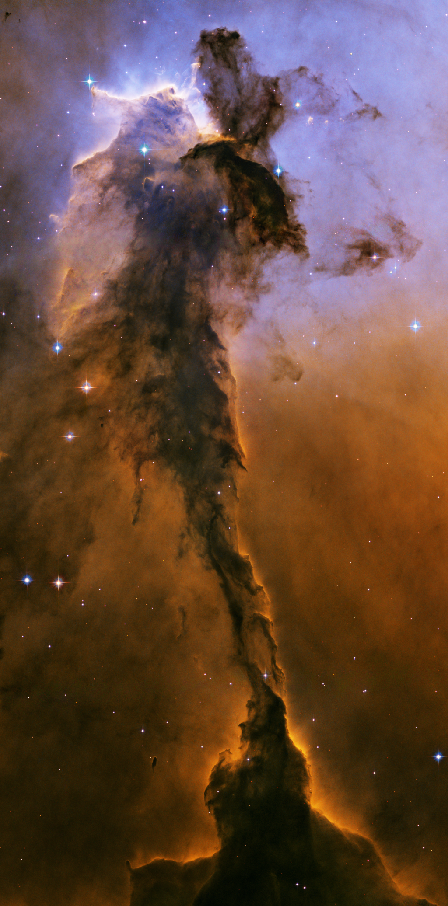](./hst-heic0506b)  

[Source](https://www.spacetelescope.org/images/heic0506b/)  
NASA/ESA/The Hubble Heritage Team (STScI/AURA)  

## `heic0515a`

### Most Detailed Image of the Crab Nebula

[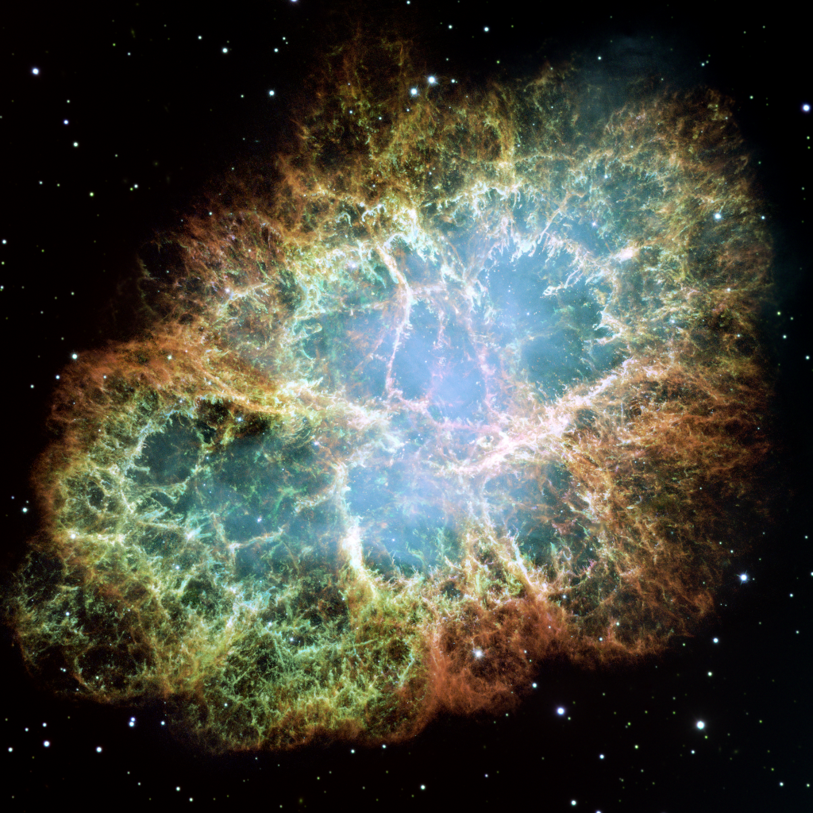](./hst-heic0515a)  

[Source](https://www.spacetelescope.org/images/heic0515a/)  
NASA/ESA/Allison Loll/Jeff Hester (Arizona State University)/Davide De Martin (ESA/Hubble)  

## `heic0602a`

### Largest Ever Galaxy Portrait - Pinwheel Galaxy

[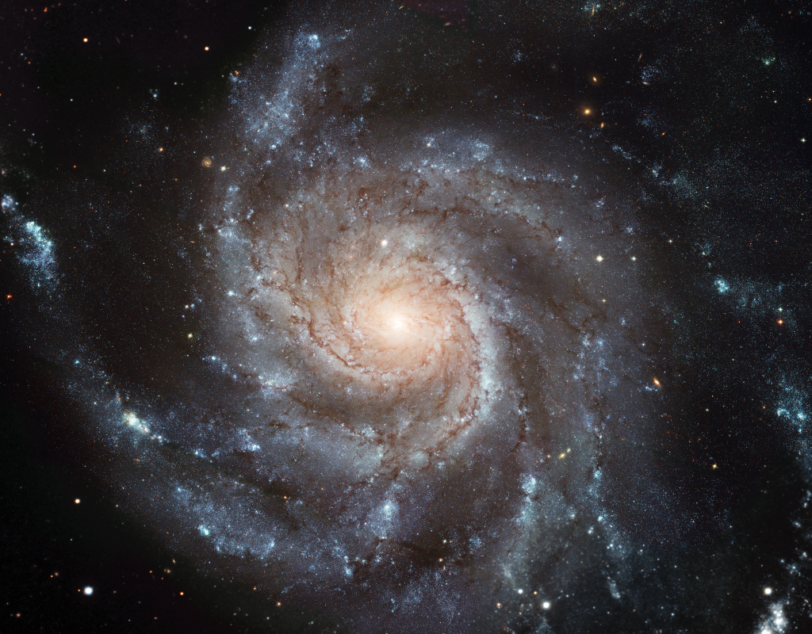](./hst-heic0602a)  

[Source](https://www.spacetelescope.org/images/heic0602a/)  
NASA/ESA/K.D. Kunts (GSFC)/F. Bresolin (University of Hawaii)/J. Trauger (JPL), J. Mould (NAOA)/Y.H. Chu (University of Illinois, Urbana)/Davide De Martin (ESA/Hubble)/Canada-France-Hawaii Telescoe/J.C. Cuillandre/Coelum/George Jacoby/Bruce Bohannan/Mark Hanna/NOAO/AURA/NSF    

## `heic0604a`

### The Magnificent Starburst Galaxy Messier 82

[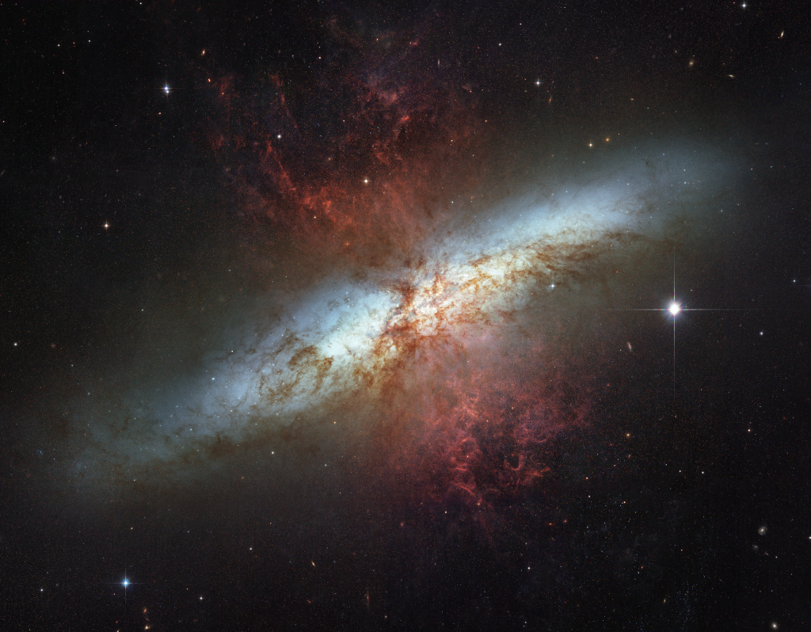](./hst-heic0604a)  

[Source](https://www.spacetelescope.org/images/heic0604a/)  
NASA/ESA/The Hubble Heritage Team (STScI/AURA)/J. Gallagher (University of Wisconsin)/M. Mountain (STScI)/P. Puxley (NSF)  

## `heic0707a`

### Star Birth in the Extreme

[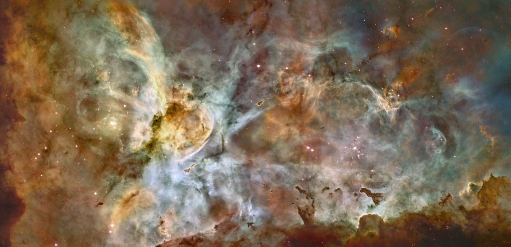](./hst-heic0707a)

[Source](https://www.spacetelescope.org/images/heic0707a/)  
NASA/ESA/N. Smith (U.C. Berkeley)/Hubble Heritage Team (STScI/AURA)  

## `heic0910e`

### WFC3 Visible Image of the Carina Nebula

[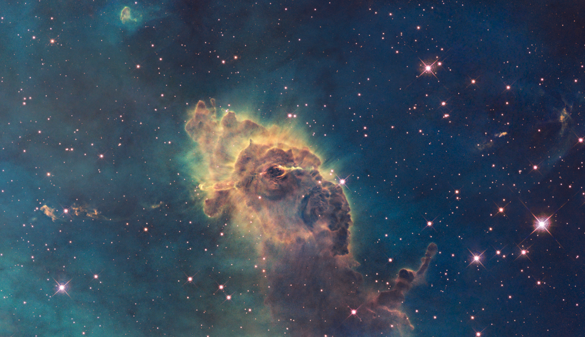](./hst-heic0910e)  

[Source](https://www.spacetelescope.org/images/heic0910e/)  
NASA/ESA/Hubble SM4 ERO Team  

## `heic1104a`

### Flocculent Spiral NGC 2841

[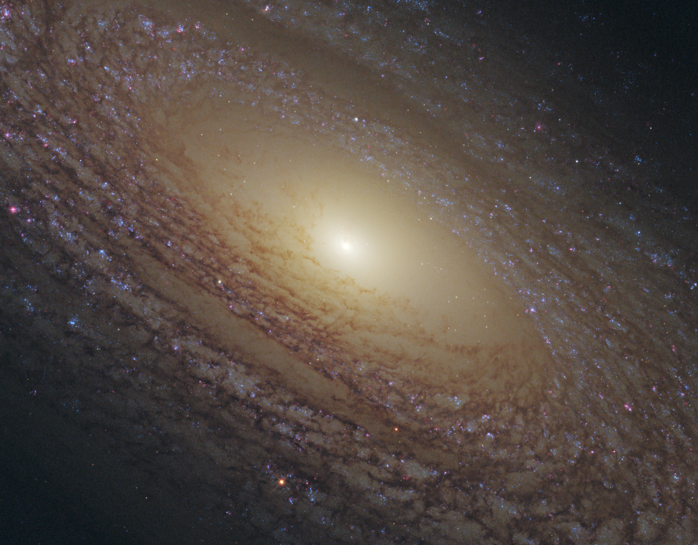](./hst-heic1104a)  

[Source](https://www.spacetelescope.org/images/heic1104a/)  
NASA/ESA/The Hubble Heritage Team (STScI/AURA)/M. Crockett and S. Kaviraj (Oxford University, UK)/R. O'Connell (University of Virginia)/B. Whitmore (STScI)/WFC3 Scientific Oversight Comittee  

## `heic1110a`

### Spectacular Hubble View of Centaurus A

[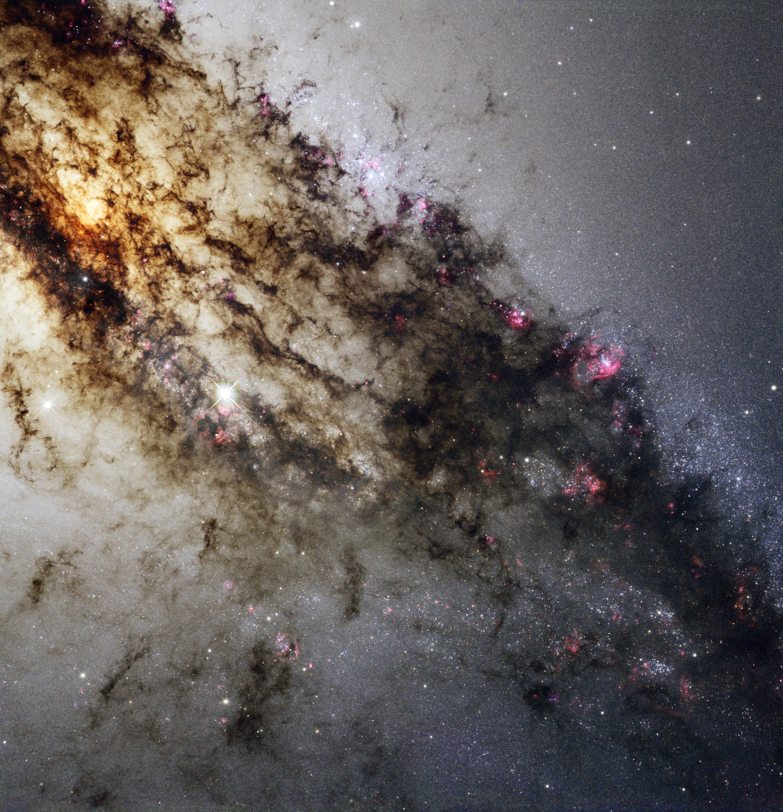](./hst-heic1110a)  

[Source](https://www.spacetelescope.org/images/heic1110a/)  
NASA/ESA/Hubble Heritage (STScI/AURA)/Hubble Collaboration/R. O'Connell (University of Virginia)/WFC3 Scientific Oversight Committee  

## `heic1302a`

### Hubble View of Messier 106

[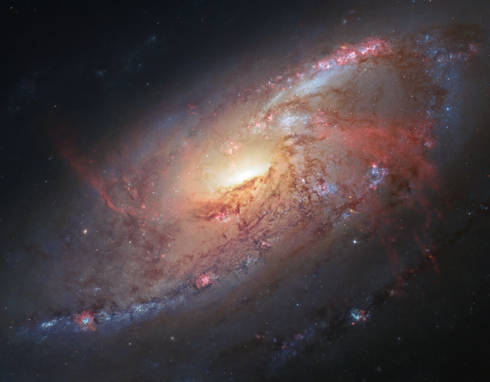](./hst-heic1302a)  

[Source](https://www.spacetelescope.org/images/heic1302a/)  
NASA/ESA/The Hubble Heritage Team (STScI/AURA)/R. Gendler/J. GaBany  

## `heic1501a`

### Pillars of Creation

[Source](https://www.spacetelescope.org/images/heic1501a/)  
NASA/ESA/Hubble/Hubble Heritage Team  

## `heic1502a`

### Sharpest Ever View of the Andromeda Galaxy

[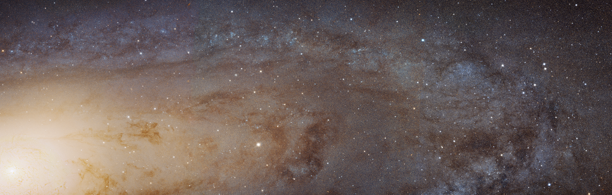](./hst-heic1502a)  

[Source](https://www.spacetelescope.org/images/heic1502a/)  
NASA/ESA/J. Dalcanton (University of Washington)/B. F. Williams (University of Washington)/L. C. Johnson (University of Washington)/The PHAT Team/R. Gendler    

## `heic1509a`

### Westerlund 2

[Source](https://www.spacetelescope.org/images/heic1509a/)  
NASA/ESA/Hubble Heritage Team (STScI/AURA)/A. Nota (ESA/STScI)/Westerlund 2 Science Team  

## `heic1520a`

### Revisiting the Veil Nebula

[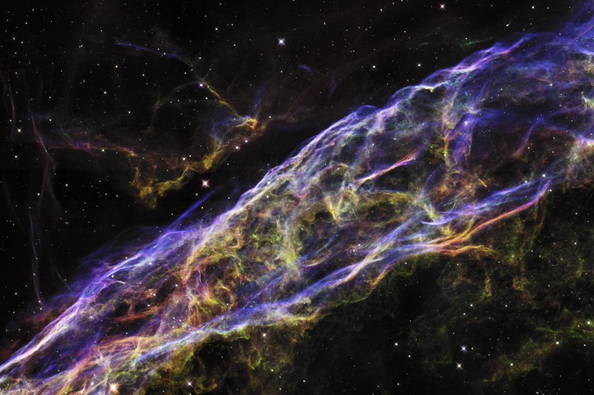](./hst-heic1520a)  

[Source](https://www.spacetelescope.org/images/heic1520a/)  
NASA/ESA/Hubble Heritage Team  

## `heic1608a`

### The Bubble Nebula

[Source](https://www.spacetelescope.org/images/heic1608a/)  
NASA/ESA/Hubble Heritage Team  

## `heic1712a`

### NGC 1512 and NGC 1510

[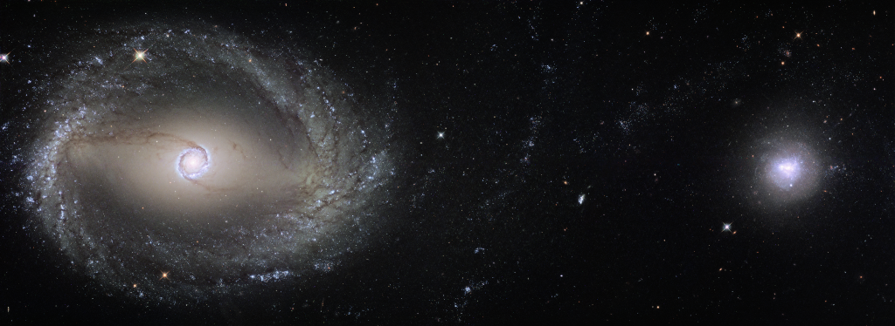](./hst-heic1712a)  

[Source](https://www.spacetelescope.org/images/heic1712a/)  
NASA/ESA/Hubble  

## `heic1716a`

### Result of a Galactic Crash - NGC 4490

[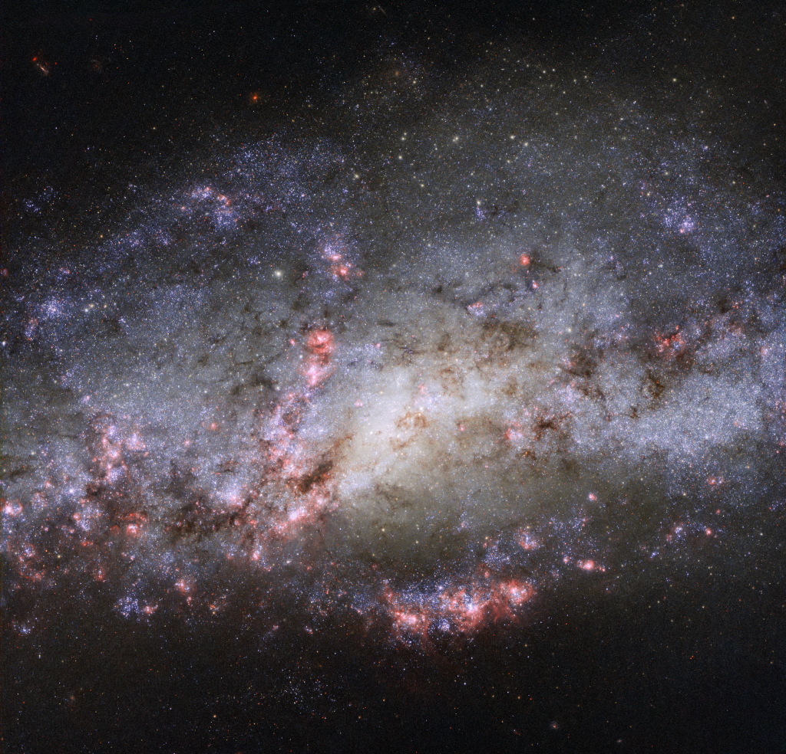](./hst-heic1716a)  

[Source](https://www.spacetelescope.org/images/potw1940a/)  
NASA/ESA/Hubble/D. Calzetti (UMass)/The LEGUS Team/J. Maund (University of Sheffield)/R. Chandar (University of Toledo)  

## `heic1808a`

### Lagoon Nebula

[Source](https://www.spacetelescope.org/images/heic1808a/)  
NASA/ESA/STScI  

## `heic1811a`

### Peculiar Galaxy NGC 3256

[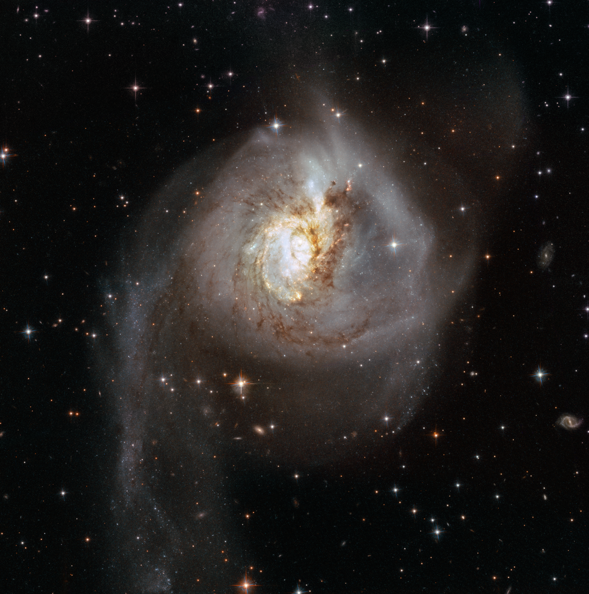](./hst-heic1811a)  

[Source](https://www.spacetelescope.org/images/heic1811a/)  
NASA/ESA/Hubble  

## `heic2002a`

### UCG 2885

[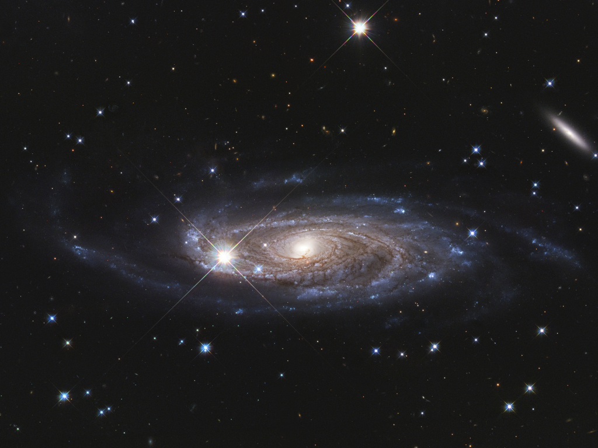](./hst-heic2002a)

[Source](https://www.spacetelescope.org/images/heic2002a/)  
NASA/ESA/B. Holwerda (University of Louisville)

## `heic2002b`

### Area Around UCG 2885

[Source](https://www.spacetelescope.org/images/heic2002b/)  
ESA/Digitized Sky Survey 2/Davide De Martin  

## `opo0501a`

### A Poster-size Image of the Beautiful Barred Spiral Galaxy NGC 1300

[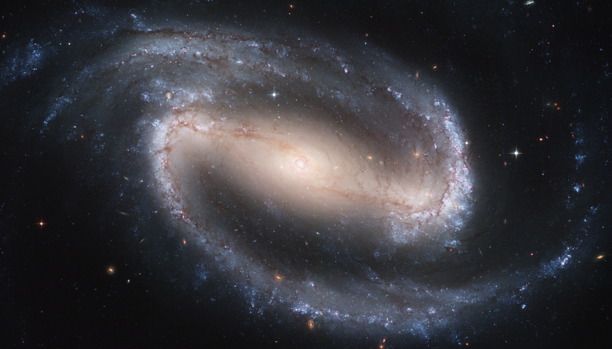](./hst-opo0501a)  

[Source](https://www.spacetelescope.org/images/opo0501a/)  
NASA/ESA/The Hubble Heritage Team (STScI/AURA)  

## `opo0928b`

### Galactic Center Region

[Source](https://www.spacetelescope.org/images/opo0928b/)  
NASA/ESA/SSC/CXC/STScI  

## `opo1438b`

### Spiral Galaxy M81

[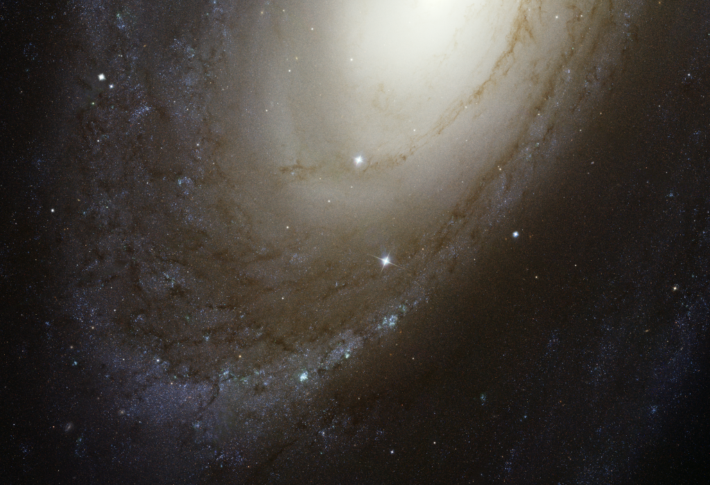](./hst-opo1438b)  

[Source](https://www.spacetelescope.org/images/opo1438b/)  
NASA/ESA/A. Zezas (CfA)/A. Filippenko (UC Berkeley)/Hubble Heritage Team (STScI/AURA)/O. Fox (University of California, Berkeley)  

## `potw1411a`

### Secrets at the Heart of NGC 5793

[Source](https://www.spacetelescope.org/images/potw1411a/)  
NASA/ESA/E. Perlman (Florida Institute of Technology)/Judy Schmidt

## `potw1805a`

### Twins with Differences

[Source](https://www.spacetelescope.org/images/potw1805a/)  
ESA/Hubble/NASA/D. Milisavljevic (Purdue University)  

## `potw1850a`

### Messier 100 in the Constellation Coma Berenices

[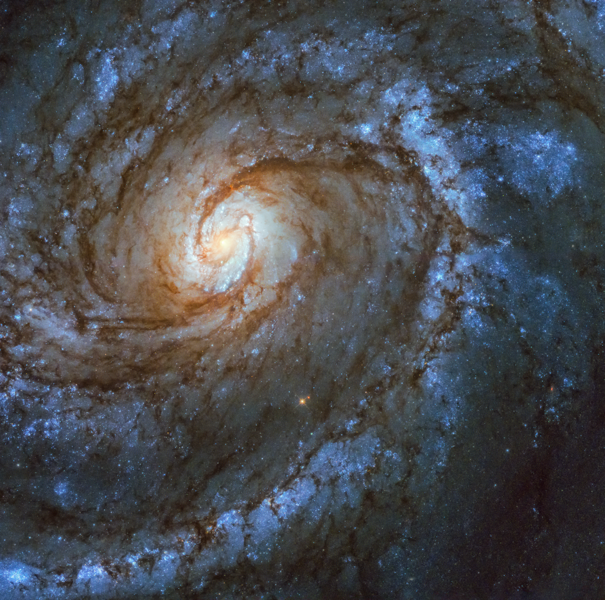](./hst-potw1850a)  

[Source](https://www.spacetelescope.org/images/potw1850a/)  
NASA/ESA  

## `potw1940a`

### A Spiral in Profile - NGC 3717

[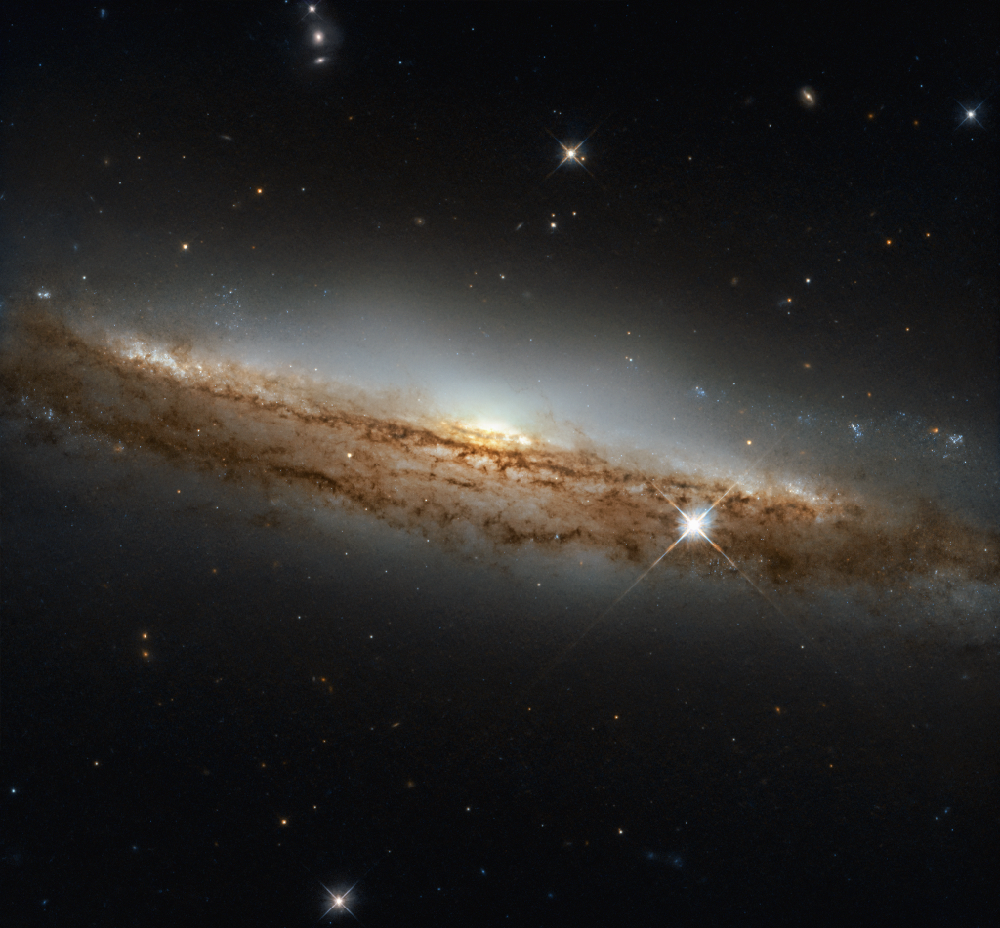](./hst-potw1940a)  

[Source](https://www.spacetelescope.org/images/potw1940a/)  
NASA/ESA/Hubble/D. Rosario  

## `potw2004a`

### Bars and Baby Stars

[Source](https://www.spacetelescope.org/images/potw2004a/)  
ESA/Hubble/NASA/A. Riess et al.