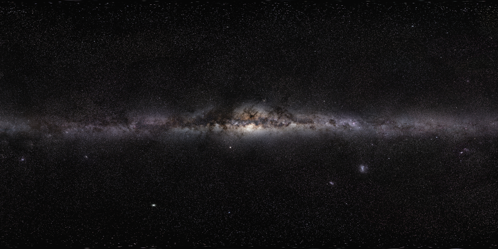
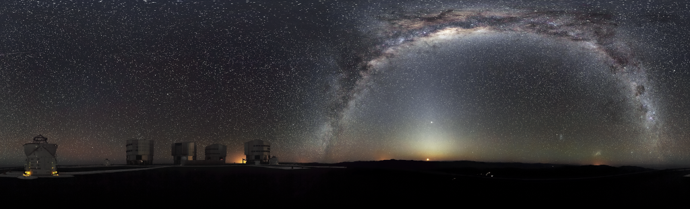

# Space Images

This is a project I've undertaken as a hobby to gain a better understanding of astronomy.

## `eso0650a`

### Portrait of a Dramatic Stellar Crib

  

[Source](https://www.eso.org/public/images/eso0650a/)  
ESO/R. Fosbury (ST-ECF)  

## `eso0848a`

### NGC 2264 and the Christmas Tree Cluster

  

[Source](https://www.eso.org/public/images/eso0848a/)  
ESO  

## `eso0907a`

### The Helix Nebula

  

[Source](https://www.eso.org/public/images/eso0907a/)  
ESO  

## `eso0932a`

### The Milky Way Panorama

  

[Source](https://www.eso.org/public/images/eso0932a/)  
ESO/S. Brunier  

## `eso0934a`

### A 340-million Pixel Starscape from Paranal

  

[Source](https://www.eso.org/public/images/eso0934a/)  
ESO/S. Guisard (https://www.eso.org/~sguisard)  

## `eso0949a`

### The Hidden Fires of the Flame Nebula

  

[Source](https://www.eso.org/public/images/eso0949a/)  
ESO/J. Emerson/VISTA/Cambridge Astronomical Survey Unit  

## `eso1119b`

### VST Image of the Giant Blobular Cluster Omega Centauri

  

[Source](https://www.eso.org/public/images/eso1119b/)  
ESO/INAF-VST/OmegaCAM/A. Grado/L. Limatola/INAF-Capodimonte Observatory  

## `eso1208a`

### ESO's VLT Reveals the Carina Nebula's Hidden Secrets

  

[Source](https://www.eso.org/public/images/eso1208a/)  
ESO/T. Preibisch  

## `eso1242a`

### Central Milky Way Mosaic

[Source](https://www.eso.org/public/images/eso1242a/)  
ESO/VVV Survey/D. Minniti

## `eso1625a`

### A Deep Infrared View of the Orion Nebula from HAWK-I

  

[Source](https://www.eso.org/public/images/eso1625a/)  
ESO/H. Drass et al.  

## `eso1907a`

### First Image of a Black Hole

  

[Source](https://www.eso.org/public/images/eso1907a/)  
EHT Collaboration  

## `potw1226a`

### Mars, 2099?

  

[Source](https://www.eso.org/public/images/potw1226a/)  
ESO/J.Girard (djulik.com)    

## `vlt-mw-potw`

### Rare 360-degree Panorama of the Southern Sky

  

[Source](https://www.eso.org/public/images/vlt-mw-potw/)  
ESO/H.H. Heyer  

## `heic0707a`

### Star Birth in the Extreme

[Source](https://www.spacetelescope.org/images/heic0707a/)  
NASA/ESA/N. Smith (U.C. Berkeley)/Hubble Heritage Team (STScI/AURA)

## `heic1501a`

### Pillars of Creation

[Source](https://www.spacetelescope.org/images/heic1501a/)  
NASA/ESA/Hubble/Hubble Heritage Team

## `heic1509a`

### Westerlund 2

[Source](https://www.spacetelescope.org/images/heic1509a/)  
NASA/ESA/Hubble Heritage Team (STScI/AURA)/A. Nota (ESA/STScI)/Westerlund 2 Science Team

## `heic1608a`

### The Bubble Nebula

[Source](https://www.spacetelescope.org/images/heic1608a/)  
NASA/ESA/Hubble Heritage Team

## `heic1808a`

### Lagoon Nebula

[Source](https://www.spacetelescope.org/images/heic1808a/)  
NASA/ESA/STScI

## `heic2002a`

### UCG 2885

[Source](https://www.spacetelescope.org/images/heic2002a/)  
NASA/ESA/B. Holwerda (University of Louisville)

## `heic2002b`

### Area Around UCG 2885

[Source](https://www.spacetelescope.org/images/heic2002b/)  
ESA/Digitized Sky Survey 2/Davide De Martin

## `opo0928b`

### Galactic Center Region

[Source](https://www.spacetelescope.org/images/opo0928b/)  
NASA/ESA/SSC/CXC/STScI

## `potw1411a`

### Secrets at the Heart of NGC 5793

[Source](https://www.spacetelescope.org/images/potw1411a/)  
NASA/ESA/E. Perlman (Florida Institute of Technology)/Judy Schmidt

## `potw1805a`

### Twins with Differences

[Source](https://www.spacetelescope.org/images/potw1805a/)  
ESA/Hubble/NASA/D. Milisavljevic (Purdue University)

## `potw2004a`

### Bars and Baby Stars

[Source](https://www.spacetelescope.org/images/potw2004a/)  
ESA/Hubble/NASA/A. Riess et al.